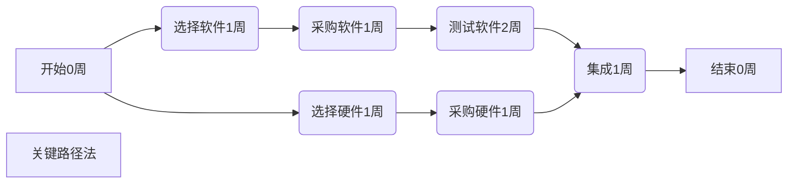

# 学习project软件

## 建立基本项目信息

### 项目信息---(项目-项目信息)

1. 日程排定方法（开始时间---正排序，完成时间---倒排序）

   >选择 其一只能填写相关的一个日期
   >
   >比如 选择开始时间 就只可填写开始日期

2. 日历（作息时间安排项目）

   >标准
   >
   >24小时
   >
   >夜班

   - 更改工作（日历）时间，可进行对工作非工作日进行修改

     - 工作周指定义上班的时间

     - 例外日期相对于工作周的例外的日期

     - 如果当前日历（工作周和例外日期）不满足需求的时候，可以点击右上角进行“新建日历”

       >新建完之后需要回到项目信息选择新定义的日历，才会生效

     

3. 资源信息--->资源工作表

   **<u>编辑的时候，双击弹出窗口，单击输入资源名称，失去焦点后，后面的某些列自动补充</u>**

   - 类型

     >工时---> 人员、设备、场地等
     >
     >材料---> 消耗品
     >
     >成本（万华暂时不会考虑成本问题）---> 差旅费等直接成本

   - 标准费率（资源的单价） 

   - 最大单位（资源的最大值/总量，工时资源可用性）

   - 材料标签（材料资源的计量单位）

   - 每次使用成本（额外成本）

   

### 文件安全性 （保护文件）

- 在文件保存中右下角的工具-常规选项    进行对文件加密

## 用project编制范围计划

### 输入任务

**<u>任务输入完成的时候，默认工期为“一个工作日”，开始时间是项目信息的开始日期</u>**

**<u>但是 节假日这些需要手动录入</u>**

#### 任务模式

- 全选
  - 点击左上角空白部分，选择卡的“任务”--“自动安排/手动安排”
- 单选
  - 任务模式下拉选择 自动或者手动安排

>如果是手动安排的话 
>
>可以自由输入工期 开始/结束日期等
>
> 
>
>输入的工期导致当前任务的完成时间延长，会影响某些关联的任务引起冲突

#### 输入方式

>手动输入、复制粘贴
>
>使用模板
>
>从Outlook导入

#### 任务周期（任务-任务-任务周期）

#### 编制分解结构【选择二级下面的节点-（任务-日程-左下角降级任务）】

#### 备注（项目有关信息）

【 1. 选择一条任务 ，再任务-属性-信息-备注

2. 双击任务，切换到备注】

## 编制进度计划

>活动定义、活动排序、活动资源估计、活动历时估计、进度计划开发

1. 依赖关系

   >强制性、任务决定的、外部因素决定的

2. 依赖类型

   >FS、FF、SS、SF
   >
   > 
   >
   >F表示finish，s表示start
   >
   >默认为FS，表示上个节点结束下一个节点开始

3. 强制性、任务决定的、外部因素决定的

4. 任务之间的依赖关系

   - 简单建依赖关系【选择需要建立依赖关系的子节点，点击（任务-日程靠上的链接选定任务）】

     - 从第二个开始默认子节点的开始日期加一，工期还是默认的一个工作日，

       前置任务为为上个节点的序号，依赖关系默认为FS

     - 打开任务相关性窗口

       > 在甘特图界面双击需要修改的（上级到下级的箭头）

     - 修改延隔时间（可填负数）

       >注意周末的时间
       
       - 填写负数 一般用于压缩工期，前一个任务还没完成，后一个任务就要开始了

## 估计工期、分配资源

### 分配资源---（选择具体的任务，在点击资源-分配资源）

- 选择当前任务需要配置的资源（数据来源于最初的资源工作表），点击分配

- 分配单位

  >这项资源分配到这个项目的占比

  - 分配单位一旦配置好，自动算出成本和工时（意味着不可修改）

    >成本根据 标准费率*工时+每次使用成本+加班费（如果有加班的话）
    >
  
- 工期

  >默认单位工作日
  >
  >单位： 工时、工作日、周工时
  >
  >连续工期
  >
  >
  >
  >1w - 1周工时
  >
  >
  >
  >96eh - 96小时    96h- 96工时
  >
  >>前者连续4天 不受日历影响
  >>
  >>后者受日历影响

  - 工期=工时/资源单位 

- 里程碑（双击需要修改的任务，选择高级）

  >完成项目规范

  - 控制节点（ 工期为“0”）

  - 标记为里程碑 甘特图上显示一个菱形

  - 任务类型

    >固定工期，固定工时，固定单位（资源分配单位）

  - 投入比导向

    - 如果同一个任务有多个资源（一样的工时工期），如果删除其中一个，工时不变，工期会缩短一半。

  - 排定日程时忽略资源日历
  
    - 如果此项目的日期特殊性可以设定
  
    

## 建立限制和期限日期

>限制日期 指 根据限制类型定义的日期 
>
>在甘特图上是一个菱形
>
> 
>
>期限日期 指 最后期限
>
>在甘特图上面是一个向下的箭头

### 日程表(视图-拆分视图-日程表)

- 添加任务到日程表(选择一任务，任务-属性上方的添加到日程表)

  >里程碑相关的任务 需要加入到日程表
  >
  > 
  >
  >移除同理

## 浏览任务

### 甘特图

### 网络图（右侧选择网络图视图）

>工作的流程图

## 浏览资源计划

### 资源工作表

>如果资源显示红色 表示分配过度，资源冲突了

- 资源冲突
  - 如果在同一时间段，同一个资源超出他的最大单位，资源就会冲突

### 资源图表（资源直方图📊）

>整个资源在项目周期里面整个负荷情况

### 资源使用状况视图

>资源计划

- 插入一列叫“成本”
- 在右边的视图里面显示“成本字段”（右键）

### 报表、可视报表---（报表选择卡-查看报表-成本）

>展示成本

- 报表

  

- 可视报表

  >编制的计划的数据进行相关整理以Excel形式整理出来

## 项目统计信息--（项目-属性左边第一个项目信息-左下脚统计信息）

### 基线

>项目编制完成之后，一旦计划得到批准，工作基准

## 优化项目工程

### 影响项目日程的因素和跳转方法

- 影响项目日程的因素
  - 项目范围/wbs
  - 项目开始/完成时间
  - 项目日历
  - 项目资源技能、效率、可用性
  - 工作工期
  - 工作依赖关系
- 调整项目日程的方法
  - 变更范围
  - 调整工作工期
  - 赶工
  - 快速跟进（搭接、交叉施工）

## 浏览进度计划

- 甘特图
- 网络图视图
- 日历视图
- 报表

## 关键路径法

- 关键路径

  >上面的路径为最短完成时间，意味着多条路径，工期最长的作为他的关键路径
  >
  > 
  >
  >关键路径有多条（长度一样，都被视为关键路径）

  - 视图（跟踪甘特图、网络图）

    - 跟踪甘特图
      - 红色路径表示 关键路径

  - 计算多重关键路径---（文件-选项-高级,底部）

    >把关键路径工期差不多的路径一并设为关键路径

  - 非关键路径（关键路径--时差）对时间管理的价值

    >在一定范围内对非关键路径做时间上的调整
    >
    > 
    >
    >或者在资源上做一定的调整

- 时差

  >多条路径的时间差

- 缩短工期

  >缩短工期就需要缩短关键路径

  - 增加投入（赶工）

    - 增加资源投入

      >工期缩短，工时不变（工作量不变），所以成本没变

    - 加班

  - 调整工作依赖关系（快速跟进）

## 发现资源冲突

- 甘特图
  - 标记的列 会显示一个小红人
- 资源工作表
  - 过度分配资源 显红色
- 资源图表
  - 过度分配的强度和时间段 显红色
- 资源使用状态
  - 资源工作分配
- 资源分配视图

## 解决资源冲突

- 改变资源分配
- 安排加班
- 重新定义资源日历
- 分配兼职工作
- 控制资源开始任务工作的时间
- 通过调配资源工作负荷延迟任务
  - 调配资源--（资源-调配资源）
- 改变资源工时分布

## 任务检查器--（任务-检查任务）

## 工作规划器--（视图-资源视图-工作组规划器）专业版才有

## 调整项目成本

### 项目成本影响因素

- 项目范围/WBS

- 资源用量
- 工期
- 资源单价
- 固定成本

## 浏览项目计划成本/预算

## 调整项目成本

## 跟踪项目进展

### 建立比较基准

- 项目-日程-设置基线

#### 跟踪甘特图--(甘特图-跟踪甘特图)

- 视图-数据：表格--> 差异/工时/成本

### 记录实际信息

### 预测趋势

### 发现偏差

### 评估绩效

### 采取纠偏措施

